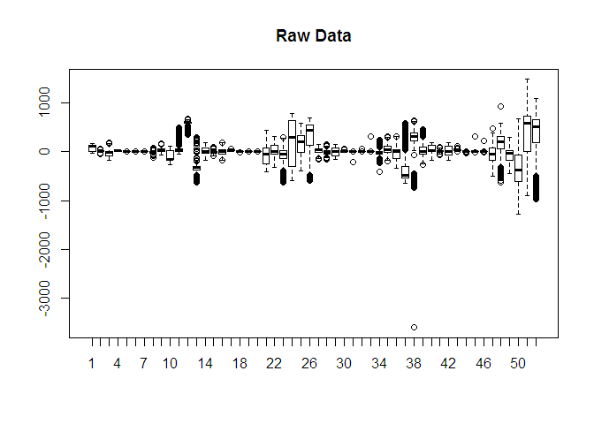
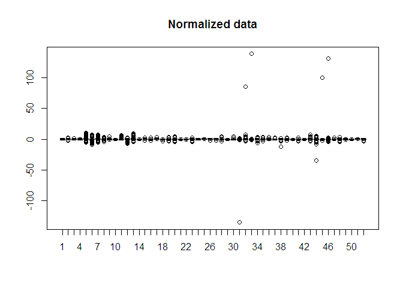
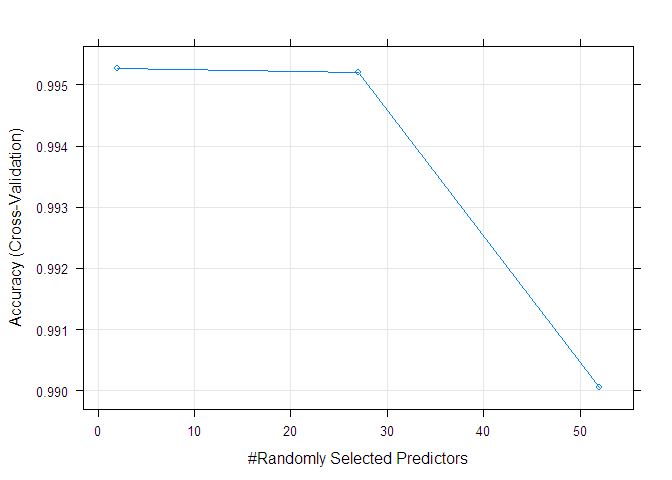
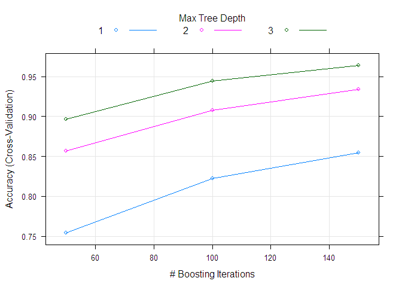

# Pratical ML-Final Project
Christian Lopez  
June 27, 2017  


#Project Introduction

##Background

Using devices such as Jawbone Up, Nike FuelBand, and Fitbit it is now possible to collect a large amount of data about personal activity relatively inexpensively. These type of devices are part of the quantified self movement - a group of enthusiasts who take measurements about themselves regularly to improve their health, to find patterns in their behavior, or because they are tech geeks. One thing that people regularly do is quantify how much of a particular activity they do, but they rarely quantify how well they do it. In this project, your goal will be to use data from accelerometers on the belt, forearm, arm, and dumbell of 6 participants. They were asked to perform barbell lifts correctly and incorrectly in 5 different ways. More information is available from the website here: http://groupware.les.inf.puc-rio.br/har (see the section on the Weight Lifting Exercise Dataset).

##Data

The training data for this project are available here: https://d396qusza40orc.cloudfront.net/predmachlearn/pml-training.csv

The test data are available here: https://d396qusza40orc.cloudfront.net/predmachlearn/pml-testing.csv

The data for this project come from this source: http://groupware.les.inf.puc-rio.br/har. If you use the document you create for this class for any purpose please cite them as they have been very generous in allowing their data to be used for this kind of assignment.

##Goal

The goal of your project is to predict the manner in which they did the exercise. This is the "classe" variable in the training set. You may use any of the other variables to predict with. You should create a report describing how you built your model, how you used cross validation, what you think the expected out of sample error is, and why you made the choices you did. You will also use your prediction model to predict 20 different test cases.

#Reproducibility

Make sure to load the necessary packages and set.seed to 33883

```r
library(caret)
library(ggplot2)
library(rpart)
library(randomForest)
library(e1071)

set.seed(33883)

data<-read.csv( "pml-training.csv",na.strings=c("#DIV/0!", " ", "<NA>" ))
validation<-read.csv("pml-testing.csv",na.strings=c("#DIV/0!", "", "<NA>" ) )
```

#Cleaning the data

For this analysis the raw data is used. That is, none of the features calculated from the sensors data is used since the goal is to accurately classify if a person is correctly performing the activity given this one instance of this raw data and not the complete time series. This is done by lookin at the Na values of the colums. The variables use are as shown bellow:

```r
data<-data[,-1]
nacol<-NULL
for( j in 7:158){
  summa<-summary(data[,j])
  if(sum(grepl("NA", names(summa)))!=0){nacol<-c(nacol,j)}else{}
  data[,j]<-as.numeric(data[,j])
}
nacol<-c(nacol, 1:6)
#data2<-data[sample(c(1:nrow(data)), 500),-nacol]
data2<-data[,-nacol]

validation<-validation[,-1]
nacol<-NULL
for( j in 7:158){
  summa<-summary(validation[,j])
  if(sum(grepl("NA", names(summa)))!=0){nacol<-c(nacol,j)}else{}
   validation[,j]<-as.numeric(validation[,j])
}
nacol<-c(nacol, 1:6)
validation<-validation[,-nacol]
```


```r
#Names of the raw data values used (predictor variables):
names(data2)
```

```
##  [1] "roll_belt"            "pitch_belt"           "yaw_belt"            
##  [4] "total_accel_belt"     "gyros_belt_x"         "gyros_belt_y"        
##  [7] "gyros_belt_z"         "accel_belt_x"         "accel_belt_y"        
## [10] "accel_belt_z"         "magnet_belt_x"        "magnet_belt_y"       
## [13] "magnet_belt_z"        "roll_arm"             "pitch_arm"           
## [16] "yaw_arm"              "total_accel_arm"      "gyros_arm_x"         
## [19] "gyros_arm_y"          "gyros_arm_z"          "accel_arm_x"         
## [22] "accel_arm_y"          "accel_arm_z"          "magnet_arm_x"        
## [25] "magnet_arm_y"         "magnet_arm_z"         "roll_dumbbell"       
## [28] "pitch_dumbbell"       "yaw_dumbbell"         "total_accel_dumbbell"
## [31] "gyros_dumbbell_x"     "gyros_dumbbell_y"     "gyros_dumbbell_z"    
## [34] "accel_dumbbell_x"     "accel_dumbbell_y"     "accel_dumbbell_z"    
## [37] "magnet_dumbbell_x"    "magnet_dumbbell_y"    "magnet_dumbbell_z"   
## [40] "roll_forearm"         "pitch_forearm"        "yaw_forearm"         
## [43] "total_accel_forearm"  "gyros_forearm_x"      "gyros_forearm_y"     
## [46] "gyros_forearm_z"      "accel_forearm_x"      "accel_forearm_y"     
## [49] "accel_forearm_z"      "magnet_forearm_x"     "magnet_forearm_y"    
## [52] "magnet_forearm_z"     "classe"
```

These variables have different scale and variance, as shown in the box plots bellow. Hence, a scale and normalization is applied  to the training data set, which will be also use in the testing and validation data set. 

```r
#Subset the variables that are numeric in nature
boxplotdata<-data2[, -53]
boxplot(boxplotdata, names=c(1:52), main="Raw Data")
```

<!-- -->

```r
#Center and Scale all varialbes (not class) == Standardizing
preObj<-preProcess(data2[,-53], method = c("center", "scale"))
preObjData<-predict(preObj,data2[,-53])
boxplot(preObjData, names=c(1:52), main="Normalized data" )
```

<!-- -->

```r
data2<-with(data2,(cbind(preObjData, classe)))

preObjDataV<-predict(preObj,validation[,-53])
validation<-(preObjDataV)
```

#Model Building

We test multiple classification algorithms via a 10-fold Cross-validation approach.

Due to computational limitation we only test a Random Forest (rf), Stochastic Gradient Boosting (gbm), and Support Vector Machine (svmLinear) classification algorithm.


##Random Forest (rf)
###10-fold CV

```r
# Set training control
control <- trainControl(method="cv", number=10)
 
# train the model with Random Forest
model_rf <- train(classe~., data=data2, trControl=control, method="rf", verbose=F)

# summarize results
accuracy_rf<-confusionMatrix(predict(model_rf,data2), data2$classe)$overall[1]
pred_rf<-predict(model_rf,validation)

print(model_rf)
```

```
## Random Forest 
## 
## 19622 samples
##    52 predictor
##     5 classes: 'A', 'B', 'C', 'D', 'E' 
## 
## No pre-processing
## Resampling: Cross-Validated (10 fold) 
## Summary of sample sizes: 17661, 17662, 17659, 17659, 17661, 17659, ... 
## Resampling results across tuning parameters:
## 
##   mtry  Accuracy   Kappa    
##    2    0.9952602  0.9940042
##   27    0.9952092  0.9939396
##   52    0.9900623  0.9874280
## 
## Accuracy was used to select the optimal model using  the largest value.
## The final value used for the model was mtry = 2.
```

```r
print(model_rf$finalModel)
```

```
## 
## Call:
##  randomForest(x = x, y = y, mtry = param$mtry, verbose = ..1) 
##                Type of random forest: classification
##                      Number of trees: 500
## No. of variables tried at each split: 2
## 
##         OOB estimate of  error rate: 0.41%
## Confusion matrix:
##      A    B    C    D    E  class.error
## A 5577    1    0    1    1 0.0005376344
## B   12 3782    3    0    0 0.0039504872
## C    0   18 3402    2    0 0.0058445354
## D    0    0   36 3178    2 0.0118159204
## E    0    0    0    5 3602 0.0013861935
```

```r
plot(model_rf)
```

<!-- -->

##Stochastic Gradient Boosting (gbm)
###10-fold CV

```r
# train the model with Stochastic Gradient Boosting
model_gbm <- train(classe~., data=data2, trControl=control, method="gbm", verbose=F)
# summarize results
accuracy_gbm<-confusionMatrix(predict(model_gbm,data2), data2$classe)$overall[1]
pred_gbm<-predict(model_gbm,validation)

print(model_gbm)
```

```
## Stochastic Gradient Boosting 
## 
## 19622 samples
##    52 predictor
##     5 classes: 'A', 'B', 'C', 'D', 'E' 
## 
## No pre-processing
## Resampling: Cross-Validated (10 fold) 
## Summary of sample sizes: 17659, 17659, 17661, 17660, 17661, 17659, ... 
## Resampling results across tuning parameters:
## 
##   interaction.depth  n.trees  Accuracy   Kappa    
##   1                   50      0.7541016  0.6882403
##   1                  100      0.8220360  0.7747515
##   1                  150      0.8546522  0.8160744
##   2                   50      0.8567941  0.8185531
##   2                  100      0.9079607  0.8835370
##   2                  150      0.9340031  0.9164847
##   3                   50      0.8969017  0.8694868
##   3                  100      0.9445014  0.9297775
##   3                  150      0.9642241  0.9547385
## 
## Tuning parameter 'shrinkage' was held constant at a value of 0.1
## 
## Tuning parameter 'n.minobsinnode' was held constant at a value of 10
## Accuracy was used to select the optimal model using  the largest value.
## The final values used for the model were n.trees = 150,
##  interaction.depth = 3, shrinkage = 0.1 and n.minobsinnode = 10.
```

```r
print(model_gbm$finalModel)
```

```
## A gradient boosted model with multinomial loss function.
## 150 iterations were performed.
## There were 52 predictors of which 44 had non-zero influence.
```

```r
plot(model_gbm)
```

<!-- -->

##Support Vector Machine (svmLinear)
###10-fold CV

```r
# train the model with Generalized Linear Model
model_svm <- train(classe~., data=data2, trControl=control, method="svmLinear", verbose=F)
# summarize results
accuracy_svm<-confusionMatrix(predict(model_svm,data2), data2$classe)$overall[1]
pred_svm<-predict(model_svm,validation)

print(model_svm)
```

```
## Support Vector Machines with Linear Kernel 
## 
## 19622 samples
##    52 predictor
##     5 classes: 'A', 'B', 'C', 'D', 'E' 
## 
## No pre-processing
## Resampling: Cross-Validated (10 fold) 
## Summary of sample sizes: 17659, 17661, 17660, 17658, 17659, 17660, ... 
## Resampling results:
## 
##   Accuracy   Kappa    
##   0.7874329  0.7297596
## 
## Tuning parameter 'C' was held constant at a value of 1
```

```r
print(model_svm$finalModel)
```

```
## Support Vector Machine object of class "ksvm" 
## 
## SV type: C-svc  (classification) 
##  parameter : cost C = 1 
## 
## Linear (vanilla) kernel function. 
## 
## Number of Support Vectors : 10037 
## 
## Objective Function Value : -2007.688 -1713.551 -1472.965 -902.2759 -1878.402 -1218.151 -2456.133 -1679.815 -1474.953 -1689.109 
## Training error : 0.207216
```

#New Predictions
These model prediction of the validation set are: 

```r
predictionMatrix<-as.data.frame(matrix(0,4,20))
rownames(predictionMatrix)<-c("pred_rf", "pred_gbm", "pred_svm", "Majority Vote")
colnames(predictionMatrix)<-c(1:20)
predictionMatrix[1,]<-pred_rf
predictionMatrix[2,]<-pred_gbm
predictionMatrix[3,]<-pred_svm

for(j in 1:20){
predictionMatrix[4,j]<-names(sort(table(predictionMatrix[,j]),decreasing=TRUE)[1])
}
print(predictionMatrix)
```

```
##               1 2 3 4 5 6 7 8 9 10 11 12 13 14 15 16 17 18 19 20
## pred_rf       B A B A A E D B A  A  B  C  B  A  E  E  A  B  B  B
## pred_gbm      B A B A A E D B A  A  B  C  B  A  E  E  A  B  B  B
## pred_svm      C A B C A E D B A  A  C  A  B  A  E  E  A  B  B  B
## Majority Vote B A B A A E D B A  A  B  C  B  A  E  E  A  B  B  B
```


